# ⚖️ Balanza Mágica

**Juego educativo de álgebra para 1° a 8° básico, alineado al currículum chileno.**
Creado por **Evelyn Álvarez Vásquez**, Profesora de Educación General Básica y Magíster en Didáctica de la Matemática.

[](https://github.com/evelyntec/balanza-magica/actions/workflows/pruebas.yml)


> El Reino del Equilibrio perdió su balance. Con **Gatito** como guía, cada estudiante recorre 8 islas
> (una por nivel escolar) restaurando balanzas, descubriendo patrones y venciendo jefes.

| Mapa (celular) | Completar la caja | Verdadero o falso |
|---|---|---|
| 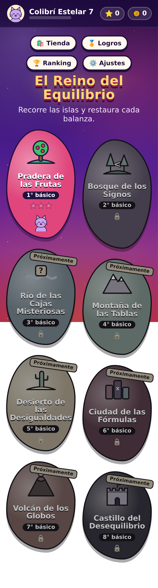 | 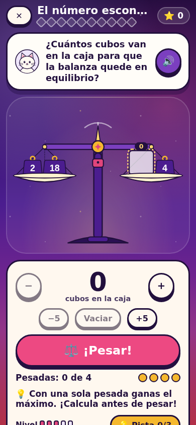 | 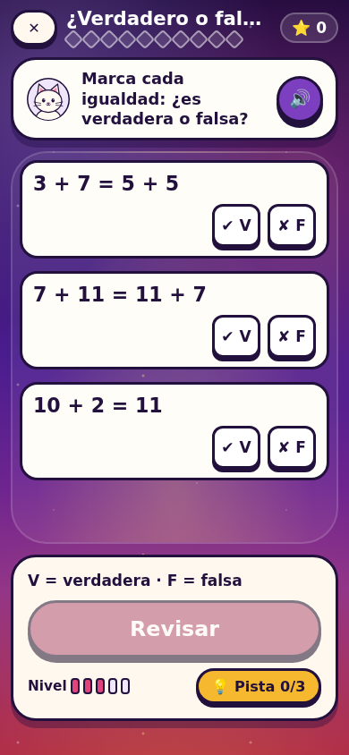 |

| La caja misteriosa (3°) | Tabla del 100 | Cuentos con cajas |
|---|---|---|
| 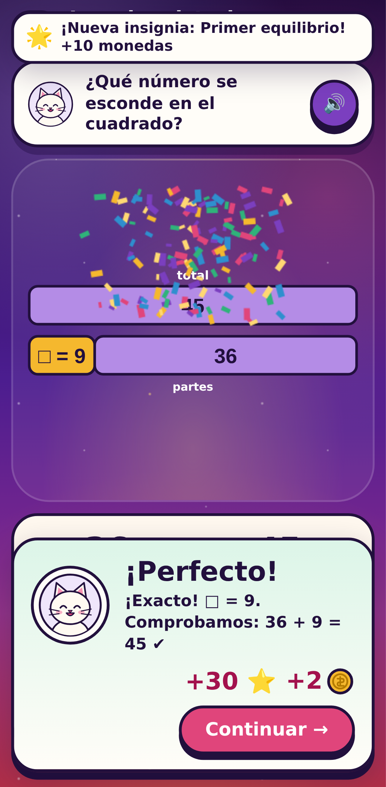 | 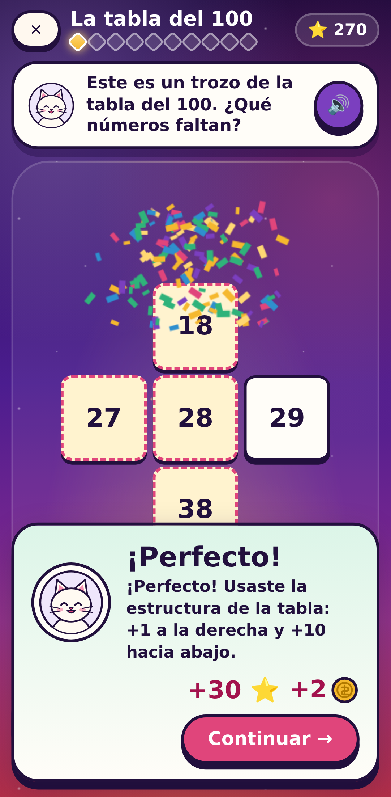 | 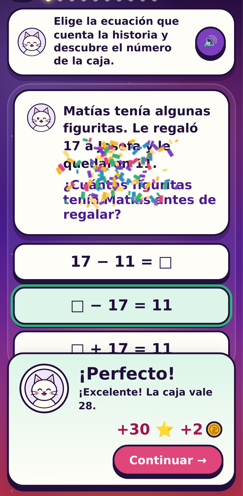 |

| La máquina de reglas (4°) | La balanza inclinada (4°) |
|---|---|
| 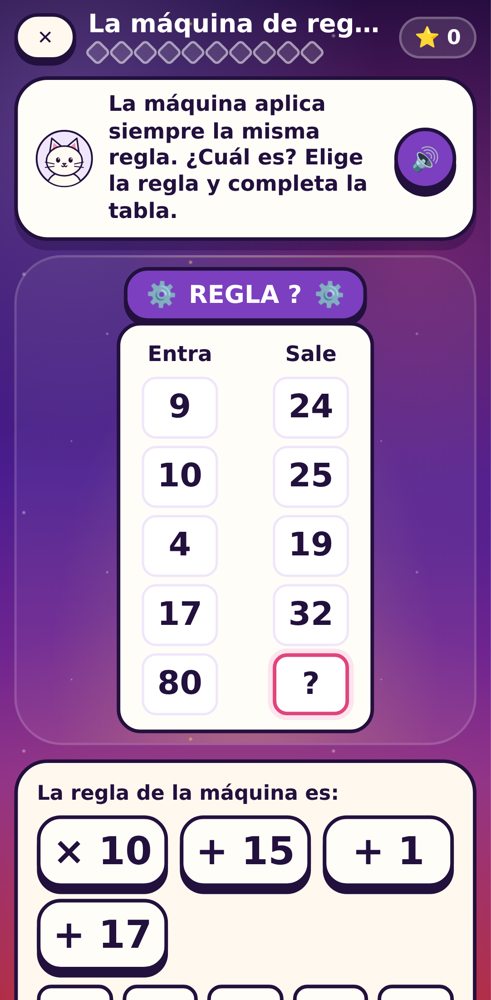 | 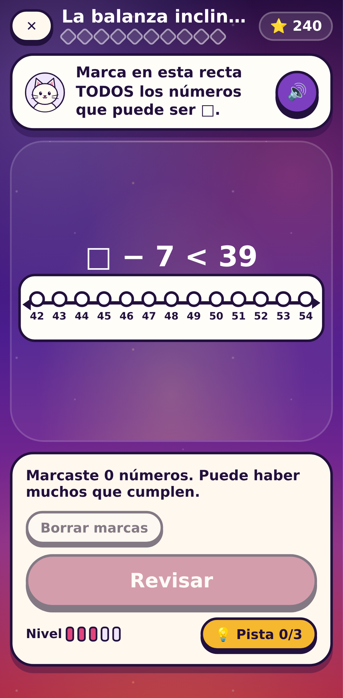 |

| Torres de palitos (5°) | Espejismos (5°) |
|---|---|
| 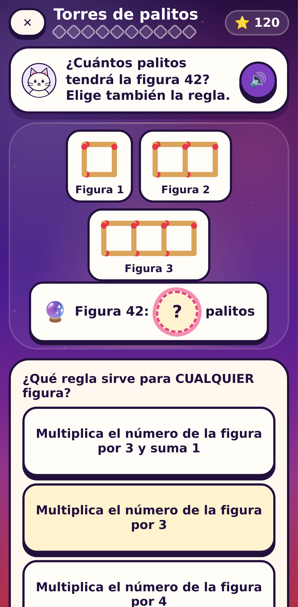 | 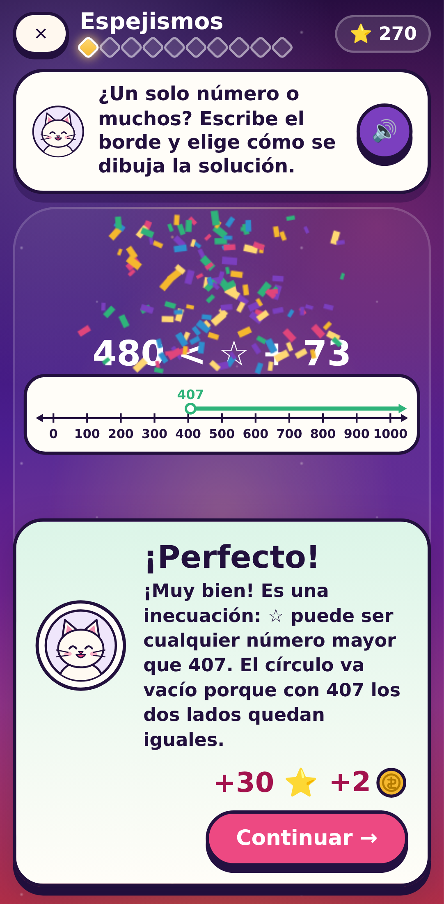 |

| Letras que generalizan (6°) | Balanza de las fórmulas (6°) |
|---|---|
| 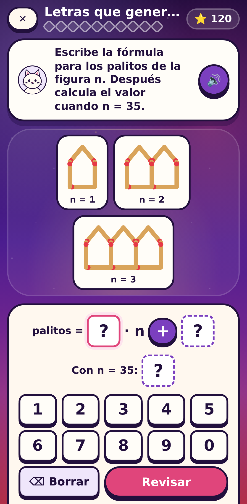 | 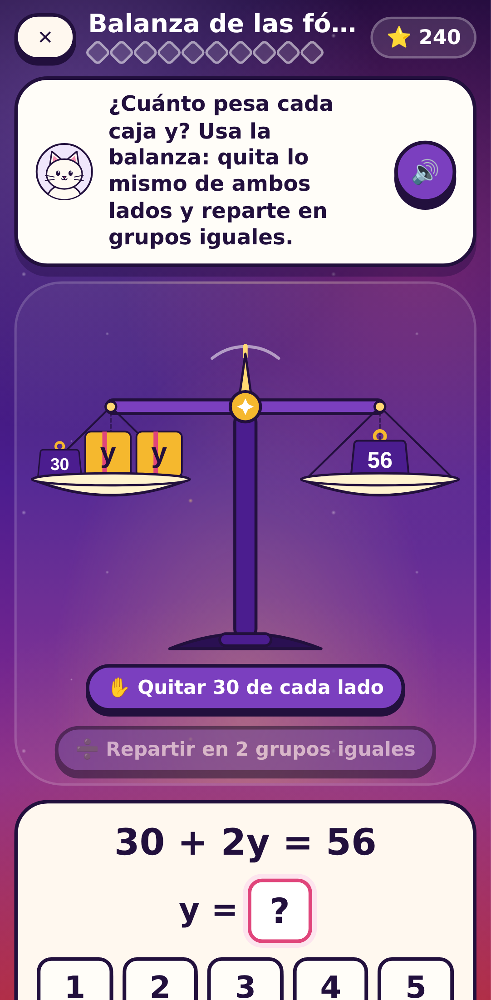 |

| Globos y sacos (7°) | Ríos proporcionales (7°, computador) |
|---|---|
| 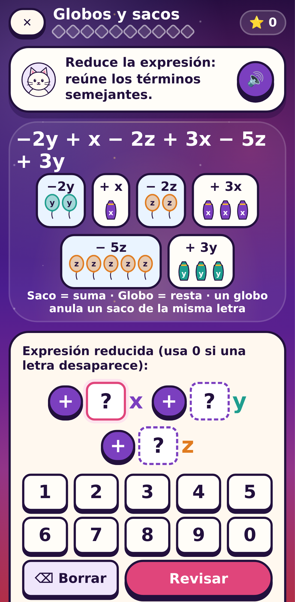 | 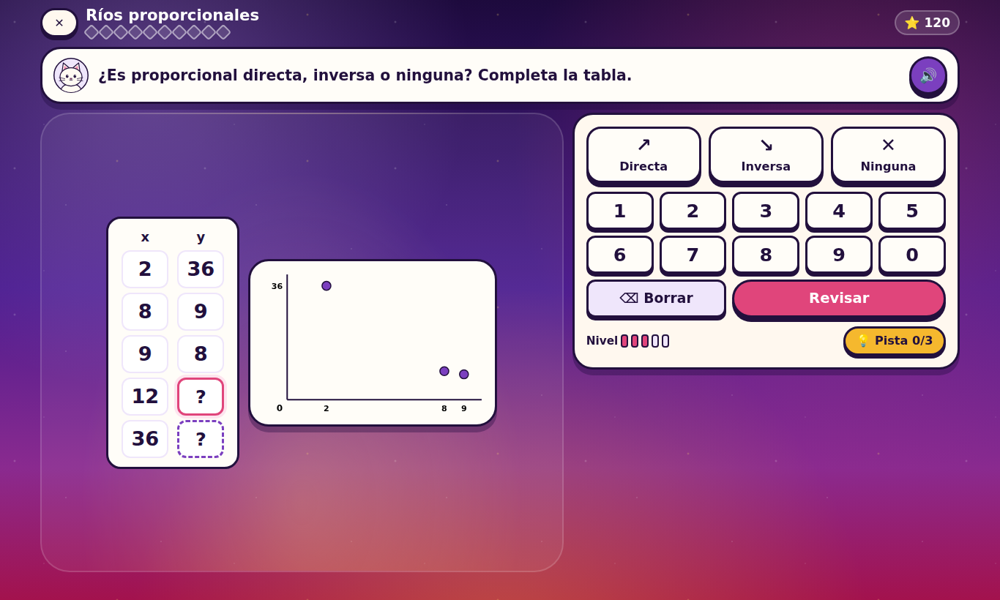 |

| Balanzas de doble carga (8°) | La máquina de funciones (8°) | Rectas del castillo (8°) |
|---|---|---|
| 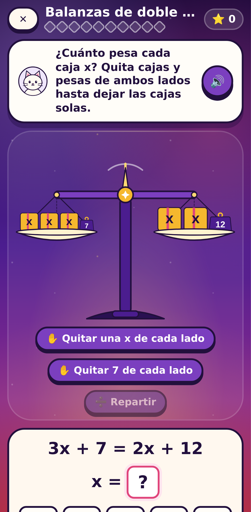 | 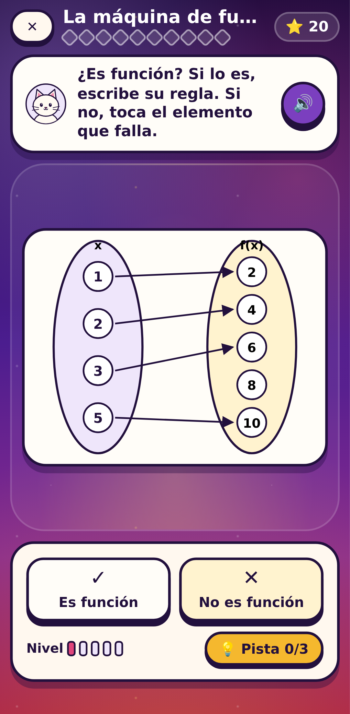 | 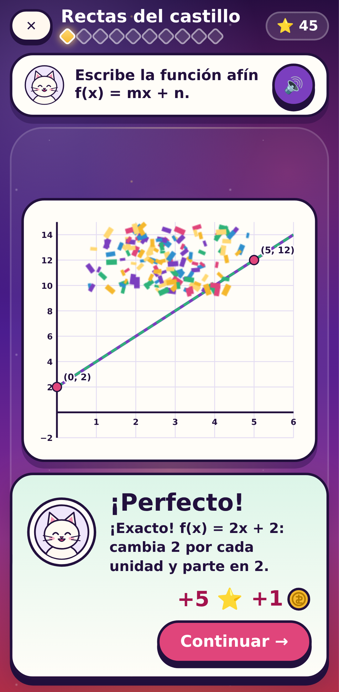 |

| Retroalimentación (computador) | Panel docente |
|---|---|
| 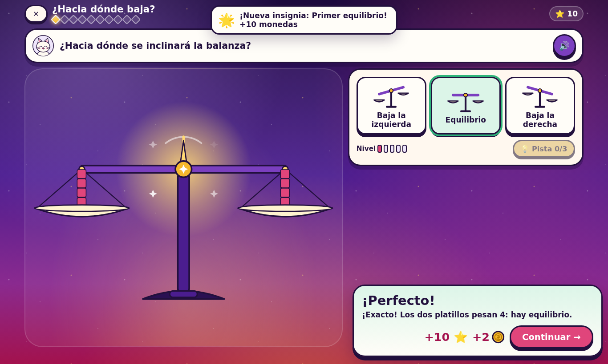 | 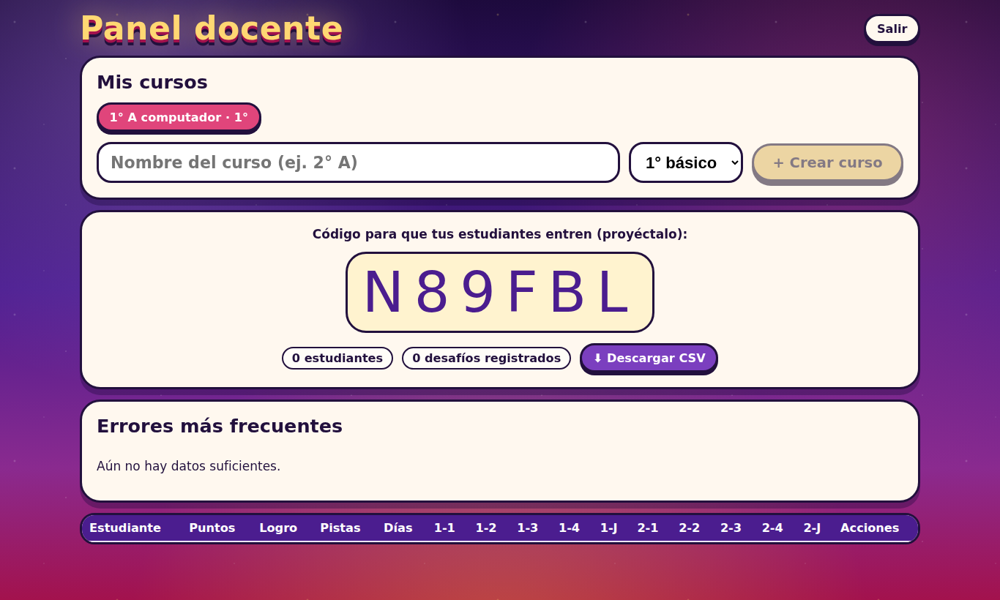 |

---

## La idea didáctica

**El estudiante no marca respuestas: manipula la balanza.** La igualdad se vive como *equilibrio* y la
desigualdad como *desequilibrio*, que es lo que piden los Objetivos de Aprendizaje de 1° y 2° básico.
Así se ataca de raíz el error que más daño hace después en álgebra: creer que el signo `=` significa
"ahora escribe el resultado".

- **Concreto → pictórico → simbólico** en cada etapa: cubos en torres de 5, pesas con números y, al final, solo símbolos.
- **Retroalimentación por error típico**, no un "incorrecto" genérico. Por ejemplo, ante `8 + 5 = □ + 7` responder `13`
  se diagnostica como visión operacional del signo igual y recibe una explicación específica.
- **Pensamiento relacional:** desafíos que se resuelven mejor *sin calcular* (`9 + 6 ○ 9 + 7`, `7 + 11 = 11 + 7`).
- **Balanza con física coherente:** siempre baja el lado más pesado, la inclinación crece con la diferencia
  (con un mínimo visible) y los platillos cuelgan verticales. El fiel central marca el equilibrio.

Fundamentación completa, con referencias (colección ReFIP, Castro y Molina, Vlassis, Kieran…): [docs/didactica.md](docs/didactica.md).

## Las 8 islas (1° a 8° básico)

| Isla | Nivel | Etapas | OA |
|---|---|---|---|
| 🍎 Pradera de las Frutas | 1° básico | ¿Hacia dónde baja? · ¡A equilibrar! · Collares y caminos · El cuaderno de Gatito · **Jefe: Cuervo Revoltoso** | MA01 OA 11, OA 12 |
| 🌳 Bosque de los Signos | 2° básico | El signo que falta · El número escondido · Senderos del bosque · ¿Verdadero o falso? · **Jefe: Bruja Ventolera** | MA02 OA 12, OA 13 |
| 🌊 Río de las Cajas Misteriosas | 3° básico | La caja misteriosa · Pesas del río · La tabla del 100 · Cuentos con cajas · **Jefe: Pulpo Escondecajas** | MA03 OA 12, OA 13 |
| 🏔️ Montaña de las Tablas | 4° básico | La máquina de reglas · Ecuaciones de la cumbre · La balanza inclinada · Cuentos de la cumbre · **Jefe: Yeti de las Tablas** | MA04 OA 13, OA 14 |
| 🏜️ Desierto de las Desigualdades | 5° básico | Huellas en la arena · Torres de palitos · Espejismos · La caravana · **Jefe: Escorpión Desigual** | MA05 OA 14, OA 15 |
| 🏙️ Ciudad de las Fórmulas | 6° básico | La fábrica de fórmulas · Letras que generalizan · Balanza de las fórmulas · Problemas con letras · **Jefe: Robot Fórmulus** | MA06 OA 9, OA 10, OA 11 |
| 🌋 Volcán de los Globos | 7° básico | Globos y sacos · Ríos proporcionales · Ecuaciones de lava · Problemas del volcán · **Jefe: Dragón de Ceniza** | MA07 OA 6, 7, 8, 9 |
| Isla 8 | 8° básico | En construcción (el motor ya está preparado: aritmética exacta con fracciones, currículo mapeado) | Ver [docs/curriculo.md](docs/curriculo.md) |

Cada etapa tiene **5 niveles de dificultad adaptativa** y ejercicios generados al azar: dos estudiantes nunca reciben los mismos números.

## Gamificación

- **Puntos acumulados** durante todo el juego y **rangos**: Aprendiz → Explorador/a → Guardián/a → Maestro/a del Equilibrio → Leyenda.
- **Estrellas (1 a 3)** por etapa: exigen precisión, pocas pistas y llegar a los niveles altos.
- **Rachas** que multiplican los puntos (×1,5, ×2, ×3), **35 insignias** y **jefes** con barra de vida.
- **Monedas** para la tienda de Gatito (sombrero de mago, corona, balanza dorada…). Nunca sirven para comprar respuestas.
- **Desafiante sin frustrar:** dos aciertos seguidos suben el nivel; dos errores seguidos bajan un nivel y activan un ejercicio con apoyo.
- **Pesadas limitadas:** en "completar la caja", acertar con **una sola pesada** da el máximo. Probar al azar no conviene.

## Pensado para el aula

- Funciona en **celular, tablet, computador y pizarra** (modo pizarra con todo más grande y pantalla completa).
- **Voz de Gatito** que lee las consignas (clave para 1° y 2°) y sonidos sintetizados, sin archivos.
- **Accesible:** navegación con teclado, etiquetas para lectores de pantalla, el color nunca es la única pista y opción de menos animaciones.
- **Privacidad:** solo se guarda un apodo, un gatito y una clave de 3 figuras (con hash). Nunca nombres, RUT ni correos.
- **Panel docente:** código de curso para proyectar, avance por estudiante y etapa, errores más frecuentes con
  sugerencias de intervención, restablecer claves y descarga CSV.

## Antitrampas

El servidor es la única autoridad: el navegador **envía acciones**, nunca puntos.

| Trampa | Cómo se bloquea |
|---|---|
| Editar puntos o monedas | Se calculan solo en el servidor; los campos extra de una petición se ignoran |
| Ver la respuesta en el código | Cada ejercicio se genera en el servidor con una semilla secreta; el navegador recibe solo la vista pública |
| Recargar para cambiar un ejercicio difícil | Un ejercicio pendiente se reanuda idéntico; abandonarlo cuenta como no logrado |
| Adivinar | Una respuesta por ejercicio, pesadas limitadas y estrellas que exigen precisión |
| Doble clic o respuestas simultáneas | Transacciones con `SELECT … FOR UPDATE`: 20 respuestas simultáneas cobran una sola vez (probado con MariaDB) |
| Dos pestañas | Una sola pestaña activa por estudiante |
| Bots o clics masivos | Tiempo mínimo de lectura y límite de ritmo |
| Adivinar la clave de otra persona | Bloqueo de 10 minutos tras 5 intentos |
| Peticiones desde otro sitio (CSRF) | Cookie `HttpOnly` + `SameSite=Strict`, cabecera propia y verificación de origen |
| Inyección SQL o de fórmulas en Excel | Consultas parametrizadas y CSV con celdas neutralizadas |

Detalle en [docs/seguridad.md](docs/seguridad.md).

## Arquitectura

```
balanza-magica/
├── packages/nucleo/        Motor en TypeScript puro (sin dependencias)
│   ├── mecanicas/          7 tipos de desafío: generan, evalúan, diagnostican y dan pistas
│   ├── curriculo.ts        8 islas, OA oficiales y etapas
│   ├── reglas.ts           Puntos, rachas, adaptatividad, estrellas, rangos, insignias, tienda
│   └── servicio/           Servicio autoritativo antitrampas (usado por el servidor y el modo práctica)
├── apps/servidor/          API Express 5 + MySQL/MariaDB, empaquetada en un solo archivo para cPanel
├── apps/juego/             React 19 + SVG propio (balanza, Gatito, frutas, islas)
├── herramientas/analisis/  Informe pedagógico en Python (pandas + matplotlib)
└── e2e/                    Juego completo en navegador real (Playwright)
```

- **Modo clase:** juego + servidor del colegio (puntos confiables, ranking y panel docente).
- **Modo práctica:** el mismo servicio corre dentro del navegador, sin servidor. Es la demo publicada.

## Pruebas

```bash
npm install
npm run typecheck        # TypeScript estricto en todo el proyecto
npm test                 # Vitest: motor, reglas, servicio, API HTTP (y MySQL si hay base de pruebas)
npm run build
npm run test:e2e         # Playwright: juego completo en celular y computador
python -m pytest herramientas/analisis
```

- **300 000 ejercicios generados y verificados** en cada ejecución: solución única, números dentro del ámbito del OA
  (0 a 20 en la balanza de 1° y 2°), sin negativos, respuesta que nunca aparece en la vista pública y retroalimentación para cada error.
- **Pruebas de propiedades** (fast-check) de la aritmética exacta y de la física de la balanza.
- **Cada trampa de la tabla anterior tiene su prueba.**
- **Recorrido completo en navegador:** la docente crea un curso, una estudiante se registra, juega una etapa entera
  por la interfaz y obtiene 3 estrellas, en celular y en computador.
- **Integración con MariaDB real:** la isla 1 completa, concurrencia, borrado en cascada y UTF-8.

## Ejecutar en tu computador

```bash
npm install
npm run dev:servidor     # API en http://localhost:3000 (memoria, sin MySQL)
npm run dev              # Juego en http://localhost:5173
npm run build:demo       # Demo de un solo archivo: apps/juego/dist-demo/index.html
```

Instalación en el hosting (V2Networks / cPanel): [docs/instalacion-cpanel.md](docs/instalacion-cpanel.md).

## Análisis de datos

Desde el panel docente se descarga un CSV; el script genera un informe HTML con gráficos: quién necesita apoyo,
en qué nivel se vuelve difícil cada desafío y cuáles errores típicos predominan.

```bash
pip install -r herramientas/analisis/requirements.txt
python herramientas/analisis/analizar.py herramientas/analisis/datos_ejemplo.csv --salida informe.html
```

`datos_ejemplo.csv` es un curso **ficticio** simulado con `herramientas/simular-curso.ts`.
También hay consultas SQL de ejemplo en [apps/servidor/sql/consultas_docente.sql](apps/servidor/sql/consultas_docente.sql).

## Hoja de ruta

- [x] Motor, servicio antitrampas, servidor, islas 1 y 2 (1° y 2° básico)
- [x] Isla 3: ecuaciones de un paso hasta 100 (balanza y modelo de barras), tabla del 100 y problemas con ecuaciones
- [x] Isla 4: tablas con regla (también inversa), ecuaciones hasta 100 e inecuaciones con balanza inclinada y recta numérica
- [x] Isla 5: sucesiones con predicción (numéricas y figuras de palitos y baldosas), gráfico de soluciones de ecuaciones e inecuaciones y problemas hasta 1000
- [x] Isla 6: fórmulas con letras escritas desde tablas, figuras y situaciones; ecuaciones a · x + b = c en la balanza y con procedimiento formal; problemas con letras
- [x] Isla 7: términos semejantes con sacos y globos (negativos), proporcionalidad directa, inversa o ninguna con gráfico, ax = b y x/a = b con sus inecuaciones, y modelación
- [x] Isla 8: incógnita a ambos lados (balanza y procedimiento formal), funciones en diagramas sagitales, función afín (gráfico, tabla, traslación e interés simple) e inecuaciones lineales con coeficientes negativos
- [ ] Despliegue automático desde GitHub al hosting y reporte semanal para la docente por correo
- [ ] Modo Detective: encontrar el error en la resolución de otro personaje
- [ ] Tutor de pistas con IA

## Licencia

Código bajo licencia [MIT](LICENSE). El texto de los Objetivos de Aprendizaje pertenece al Ministerio de Educación de Chile (curriculumnacional.cl).
